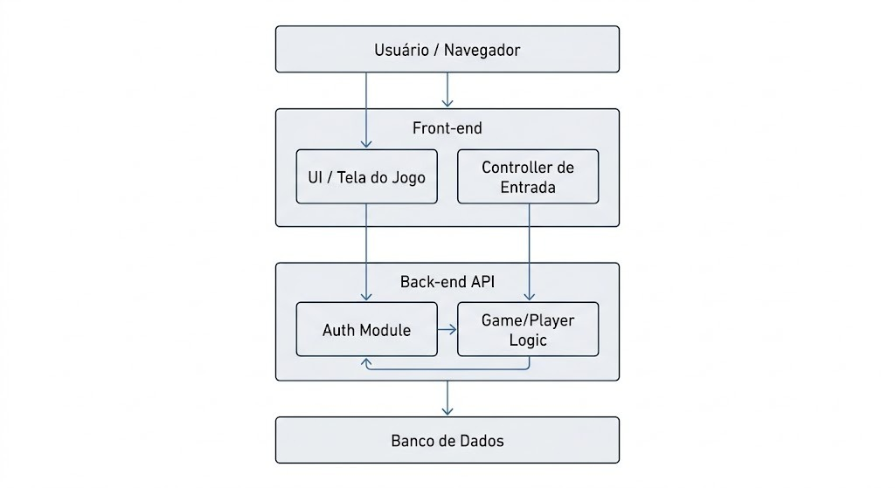

# Personagem na Tela

Projeto em grupo da disciplina **Oficina 2**.

Ferramenta visual para programação de um pequeno personagem que se move pela tela usando comandos básicos: **frente, trás, direita e esquerda**. O controle pode ser feito por **botões na tela** ou pelas **setas do teclado**.

## Equipe

| Nome | GitHub |
|------|--------|
| JOAO MARCOS ARAUJO | @joaomarcosaa |
| GABRIEL DEROLDO | @ |
| ROMULO AUGUSTO | @ |
| GABRIEL SUMIDA | @ |

## Tecnologias

| Parte | Tecnologia | Para que serve no projeto |
|-------|-----------|---------------------------|
| Front-end | HTML e JavaScript | Tela do jogo, botões de comando, captura das setas do teclado e animação do personagem |
| Back-end | Python | API do sistema: cadastro e login de usuários, regras do jogo e salvamento do progresso |
| Banco de dados | SQLite ou PostgreSQL | Guardar usuários e progresso. SQLite é mais simples para começar; PostgreSQL é mais robusto |
| Autenticação | Login com Google (OAuth 2.0) | Permitir entrar com uma conta Google (RF02) |
| Testes automatizados | Pytest (Python) e Jest (JavaScript) | Testar o back-end e o front-end |
| Versionamento | Git e GitHub | Trabalho em equipe e histórico do código |

## Arquitetura

O usuário acessa pelo navegador. O front-end (tela do jogo e controle de entrada) conversa com a API do back-end (autenticação e lógica do jogo), que guarda os dados no banco.

## Requisitos funcionais

| ID | Descrição | Prioridade |
|----|-----------|-----------|
| RF01 | O sistema deve permitir que o usuário crie uma conta. | Alta |
| RF02 | O sistema deve permitir autenticação utilizando uma conta Google. | Alta |
| RF03 | O sistema deve permitir iniciar uma atividade de movimentação do personagem. | Alta |
| RF04 | O sistema deve permitir executar comandos utilizando as setas do teclado. | Alta |
| RF05 | O sistema deve apresentar visualmente o deslocamento do personagem. | Alta |
| RF06 | O sistema deve permitir reiniciar a atividade. | Média |
| RF07 | O sistema deve apresentar instruções para a realização da atividade. | Média |
| RF08 | O sistema deve organizar a atividade em níveis de jogo com dificuldade crescente, liberando o próximo nível ao concluir o atual. | Média |
| RF09 | O sistema deve salvar o progresso do usuário e restaurá-lo em um novo acesso. | Alta |

