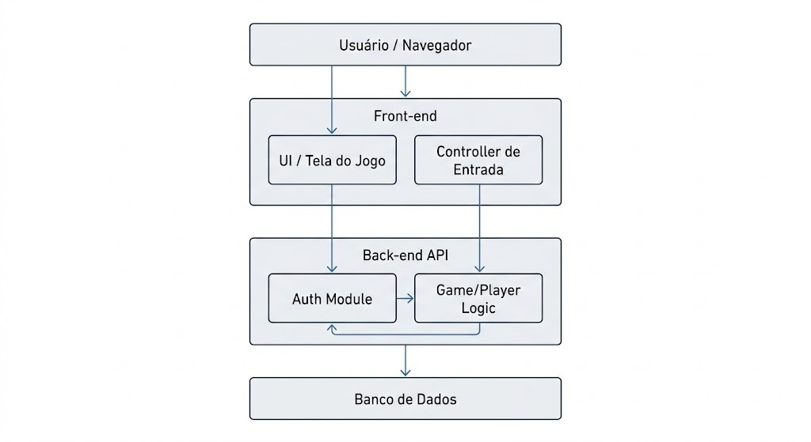

# Projeto em grupo da disciplina **Oficina 2**.

Ferramenta visual para programação de um pequeno personagem que se move pela tela usando comandos básicos: **frente, trás, direita e esquerda**.

## Equipe

| Nome | GitHub |
|------|--------|
| JOAO MARCOS ARAUJO | @joaomarcosaa |
| ROMULO AUGUSTO | @RotyDPD |
| GABRIEL DEROLDO | @ |
| GABRIEL SUMIDA | @ |

## Tecnologias

| Parte | Tecnologia | Para que serve no projeto |
|-------|-----------|---------------------------|
| Front-end | HTML e JavaScript | Tela do jogo, botões de comando, captura das setas do teclado e animação do personagem |
| Back-end | Python | API do sistema: cadastro e login de usuários, regras do jogo e salvamento do progresso |
| Banco de dados | SQLite ou PostgreSQL | Guardar usuários e progresso. SQLite é mais simples para começar; PostgreSQL é mais robusto |
| Autenticação | Login com Google (OAuth 2.0) | Permitir entrar com uma conta Google (RF02) |
| Testes automatizados | Pytest (Python) e Jest (JavaScript) | Testar o back-end e o front-end |
| Versionamento | Git e GitHub | Trabalho em equipe e histórico do código |

## Estrutura do repositório

```
.
├── backend/      # API em Python + testes com Pytest
├── frontend/     # Interface HTML/JS + testes com Jest
├── docs/         # Requisitos, arquitetura, guia de Git e backlog detalhados
├── imagens/      # Diagrama e outras imagens
└── .github/      # CI, templates de issue e de pull request
```

## Como rodar

### Back-end
```bash
cd backend
python -m venv .venv
.venv\Scripts\activate ou source .venv/bin/activate 
pip install -r requirements.txt
flask --app app.main run --debug
```
API em `http://127.0.0.1:5000` (teste: `/health`).

### Front-end
Com o back-end em execução, acesse `http://127.0.0.1:5000/`. O Flask serve a interface e a API na mesma origem.

### Login com Google (RF02)

O botão oficial do Google cria a conta no primeiro acesso e inicia uma sessão local. O servidor valida o token e sua audiência com `google-auth`, além do nonce da sessão. O Client ID de desenvolvimento já está configurado; para usar outro, defina `GOOGLE_CLIENT_ID` no ambiente antes de iniciar o Flask. Não é necessário Client Secret neste fluxo.

As origens usadas para abrir a aplicação devem estar autorizadas no cliente Web do Google Cloud (por exemplo, `http://127.0.0.1:5000` e `http://localhost:5000`). Se o e-mail já possuir uma conta local, entre com a senha; a vinculação automática de contas não é realizada.

Os testes de RF02 simulam a verificação do Google sem depender de contas ou da rede. A validação real do botão deve ser feita no navegador com uma conta Google.

## Testes
```bash
# Back-end
cd backend && pytest

# Front-end
cd frontend && npm install && npm test
```


## Arquitetura



O usuário acessa pelo navegador. O front-end (tela do jogo e controle de entrada) conversa com a API do back-end (autenticação e lógica do jogo), que guarda os dados no banco.

## Requisitos funcionais

| ID | Descrição | Prioridade |
|----|-----------|-----------|
| RF01 | O sistema deve permitir que o usuário crie uma conta. | Alta |
| RF02 | O sistema deve permitir autenticação utilizando uma conta Google. | Alta |
| RF03 | O sistema deve permitir iniciar uma atividade de movimentação do personagem. | Alta |
| RF04 | O sistema deve permitir executar comandos utilizando as setas do teclado. | Alta |
| RF05 | O sistema deve apresentar visualmente o deslocamento do personagem. | Alta |
| RF06 | O sistema deve permitir reiniciar a atividade. | Média |
| RF07 | O sistema deve apresentar instruções para a realização da atividade. | Média |
| RF08 | O sistema deve organizar a atividade em níveis de jogo com dificuldade crescente, liberando o próximo nível ao concluir o atual. | Média |
| RF09 | O sistema deve salvar o progresso do usuário e restaurá-lo em um novo acesso. | Alta |

