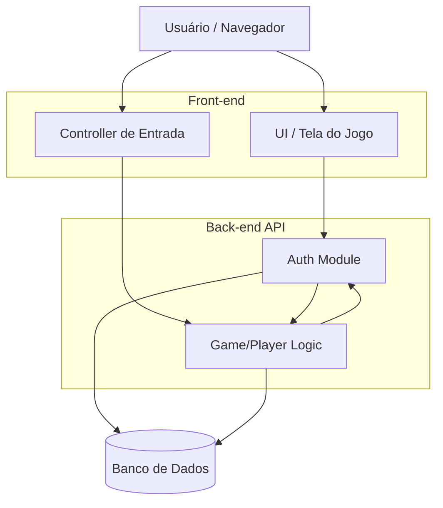

# Arquitetura

Arquitetura em camadas: **Usuário/Navegador → Front-end → Back-end API → Banco de Dados**.

## Componentes

| Componente | Responsabilidade | Requisitos |
|-----------|------------------|-----------|
| UI / Tela do Jogo | Renderizar o personagem, a grade, botões, instruções e botão de reiniciar | RF03, RF05, RF06, RF07, RF08 (seleção de níveis) |
| Controller de Entrada | Capturar setas do teclado e cliques nos botões e traduzi-los em comandos | RF04 |
| Auth Module | Cadastro, login e login com Google; validação de sessão/token | RF01, RF02 |
| Game/Player Logic | Regras de movimento, colisões, níveis, validação de conclusão, progresso do jogador, reinício | RF03, RF05, RF06, RF08, RF09 |
| Banco de Dados | Persistir usuários, atividades e progresso por nível | RF01, RF03, RF09 |

## Contrato inicial da API (proposta)

| Método | Rota | Descrição |
|--------|------|-----------|
| GET | `/health` | Verifica se a API está no ar |
| POST | `/auth/register` | Cria conta (RF01) |
| POST | `/auth/login` | Login com e-mail e senha |
| POST | `/auth/google` | Login com conta Google (RF02) |
| POST | `/game/start` | Inicia atividade (RF03) |
| POST | `/game/move` | Executa comando `frente/tras/direita/esquerda` (RF04, RF05) |
| POST | `/game/reset` | Reinicia atividade (RF06) |
| GET | `/game/levels` | Lista níveis com status liberado/bloqueado/concluído (RF08) |
| GET | `/game/levels/<id>` | Definição do nível (grade, início, meta, obstáculos) (RF08) |
| POST | `/game/levels/<id>/complete` | Valida e registra a conclusão do nível (RF08, RF09) |
| GET | `/game/progress` | Progresso do usuário logado (RF09) |

## Modelo de dados (rascunho)

- **usuario**: `id`, `nome`, `email` (único), `senha_hash` (nulo se Google), `google_id`, `criado_em`
- **atividade**: `id`, `usuario_id`, `nivel_id`, `x`, `y`, `iniciada_em`, `finalizada_em`
- **movimento**: `id`, `atividade_id`, `comando`, `x_apos`, `y_apos`, `criado_em`
- **progresso**: `id`, `usuario_id`, `nivel_id`, `concluido`, `estrelas`, `melhor_movimentos`, `atualizado_em` — único por (`usuario_id`, `nivel_id`)
- Definição dos níveis: arquivo JSON versionado no repositório (ver [niveis.md](niveis.md)); `nivel_id` referencia o `id` do JSON.
